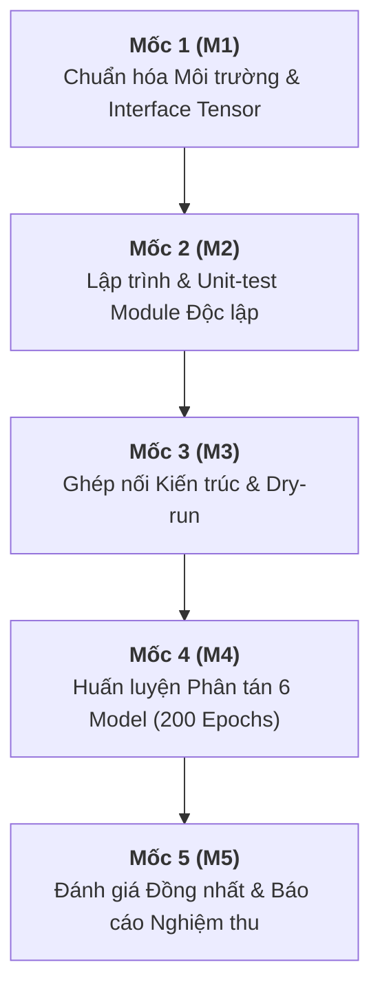

# TÁI HIỆN KIẾN TRÚC LIGHTWEIGHT YOLOV4 HELMET DETECTION (MDPI SENSORS 2023)

> **Đề tài Bài tập lớn Học máy (Machine Learning Project)**  
> **Bài báo gốc:** *Lightweight Helmet Detection Algorithm Based on Improved YOLOv4* (MDPI Sensors 2023, 23, 1256)  
> **Môi trường kỹ thuật:** Python 3.12 | PyTorch CUDA | Google Colab Distributed Training | RACI Governance Framework

---

## 1. TỔNG QUAN DỰ ÁN & MỤC TIÊU CỐT LÕI

Mục tiêu trung tâm của dự án là **tái hiện trọn vẹn và chuẩn xác thực nghiệm bóc tách (Ablation Study)** từ **Model-1 đến Model-6** theo bài báo MDPI Sensors 2023 trên tập dữ liệu mũ bảo hộ **SHWD (Safety Helmet Wearing Dataset)**:
- Nhận diện 2 lớp mục tiêu: **`hat`** (có đội mũ bảo hộ) và **`person`** (người không đội mũ bảo hộ).
- Giảm dung lượng mô hình từ **243.92 MB** (Model-1) xuống **41.88 MB** (Model-6, giảm ~82.8% kích thước bộ nhớ).
- Cải thiện độ chính xác phát hiện **mAP@0.5** từ **92.46%** lên **92.98%**.
- Tăng tốc độ xử lý suy luận (FPS) gấp **~1.87 lần**.

---

## 2. MA TRẬN PHÂN ĐỊNH TRÁCH NHIỆM (RACI MATRIX)

Dự án gồm 5 thành viên vận hành theo khung trách nhiệm RACI nhằm đảm bảo tiến độ và chất lượng:
- **T.A**: Project Lead (Chịu trách nhiệm tổng thể, PB Module, tích hợp hệ thống).
- **Sơn**: Technical Mentor (Repo base, DataLoader, CSPDarknet53 baseline, Colab sync).
- **Hưng**: Backbone & DSC Developer (PP-LCNet x1.0, Depthwise Separable Conv).
- **Tiến**: Coordinate Attention Developer (Cơ chế chú ý tọa độ 2 trục X-Y).
- **Tú**: Loss & Training Pipeline Developer (SIoU / CIoU Loss, 2-Stage Training, Metrics & Plots).

| Hạng mục / Module | File tương ứng | T.A (Lead) | Sơn (Mentor) | Hưng | Tiến | Tú |
| :--- | :--- | :---: | :---: | :---: | :---: | :---: |
| **Repo Base & Dataloader Pipeline** | `datasets/` | **A** | **R** | I | I | C |
| **PP-LCNet Backbone & DSConv Module** | `models/common.py`, `models/pp_lcnet.py` | **A** | C | **R** | I | I |
| **Coordinate Attention (CA) Module** | `models/attention.py` | **A** | C | I | **R** | I |
| **PB Module (SPP + PANet + BiFPN)** | `models/pb_module.py` | **R & A** | C | I | I | I |
| **Baseline YOLOv4 (CSPDarknet53)** | `models/cspdarknet.py` | **A** | **R** | C | I | I |
| **YOLOHead & Box Decoding** | `models/head.py` | **A** | C | I | I | **R** |
| **Lớp ráp mô hình thống nhất (Model-1..6)** | `models/yolo.py`, `configs/` | **R & A** | **R** | C | C | C |
| **SIoU/CIoU Loss Function** | `utils/loss.py` | **A** | C | I | I | **R** |
| **Huấn luyện 2 giai đoạn (Train Loop)** | `train.py` | **A** | C | I | I | **R** |
| **Đánh giá mAP, FPS, Benchmark** | `eval.py`, `utils/metrics.py` | **A** | **R** | I | I | **R** |
| **Trực quan hóa & Báo cáo nghiệm thu** | `detect.py`, `utils/plots.py` | **R & A** | I | I | I | **R** |

*Quy ước RACI: **R** (Responsible - Trực tiếp thực thi) | **A** (Accountable - Chịu trách nhiệm nghiệm thu cuối) | **C** (Consulted - Cố vấn chuyên môn) | **I** (Informed - Nhận bàn giao thông tin).*

---

## 3. CẤU TRÚC THƯ MỤC DỰ ÁN (PROJECT DIRECTORY TREE)

Codebase được thiết kế theo chuẩn module hóa cao, sẵn sàng cho 5 thành viên lập trình độc lập và ghép nối tại Mốc M3:

```
BTL-ML/
│
├── configs/                                # File cấu hình YAML cho dataset và 6 mô hình
│   ├── dataset.yaml                        # Đường dẫn dữ liệu, 2 lớp (hat, person), anchors, input size 608x608
│   ├── model1.yaml                         # Model-1: Baseline YOLOv4 (CSPDarknet53 + PANet + CIoU)
│   ├── model2.yaml                         # Model-2: YOLOv4 + DSConv
│   ├── model3.yaml                         # Model-3: PP-LCNet + DSConv
│   ├── model4.yaml                         # Model-4: PP-LCNet + CA + DSConv
│   ├── model5.yaml                         # Model-5: PP-LCNet + CA + PB Module + CIoU
│   └── model6.yaml                         # Model-6: Full cải tiến (PP-LCNet + CA + PB Module + SIoU)
│
├── datasets/                               # Quản lý, nạp và xử lý dữ liệu
│   ├── __init__.py
│   ├── prepare_data.py                     # [Sơn & T.A] Giải nén, xác thực 7,004 ảnh, tạo split train/val/test
│   ├── transforms.py                       # [Sơn] Letterbox resize (608x608), chuẩn hóa, data augmentations
│   ├── shwd.py                             # [Sơn] PyTorch Dataset, Collate Function, DataLoader
│   └── splits/                             # Thư mục lưu 3 file danh sách đường dẫn ảnh cố định
│       ├── train.txt                       # 80% tập huấn luyện
│       ├── val.txt                         # 10% tập kiểm định
│       └── test.txt                        # 10% tập đánh giá nghiệm thu độc lập
│
├── models/                                 # Định nghĩa kiến trúc mạng thần kinh (PyTorch)
│   ├── __init__.py
│   ├── common.py                           # [Hưng] Khối tích chập sâu tách biệt DSConv, ConvBnAct, conv3x3
│   ├── pp_lcnet.py                         # [Hưng] Backbone PP-LCNet x1.0 (cắt bỏ GAP/FC, ra C3, C4, C5)
│   ├── cspdarknet.py                       # [Sơn] Backbone CSPDarknet53 baseline từ YOLOv4 nguồn mở
│   ├── attention.py                        # [Tiến] Cơ chế Coordinate Attention (CA) gom cụm 2 trục X & Y
│   ├── pb_module.py                        # [T.A] PB Module: SPP + PANet + BiFPN (Weighted Add & Residual)
│   ├── head.py                             # [Tú] YOLOHead (21 kênh đầu ra), giải mã tọa độ box, NMS
│   └── yolo.py                             # [T.A & Sơn] YOLOv4Variant khởi tạo thống nhất Model-1..6 qua config
│
├── utils/                                  # Tiện ích toán học, đánh giá và đồng bộ
│   ├── __init__.py
│   ├── loss.py                             # [Tú] SIoU Loss (Angle, Distance, Shape, IoU cost) & CIoU Loss
│   ├── metrics.py                          # [Tú & Sơn] Tính AP Hat, AP Person, mAP@0.5, PR, F1, FPS, Size MB
│   ├── plots.py                            # [Tú] Vẽ đường cong Loss CIoU vs SIoU, PR curve, vẽ bbox lên ảnh
│   └── colab_sync.py                       # [Sơn] Mount Drive, tự động lưu checkpoint chống Colab timeout
│
├── notebooks/                              # Sổ tay hướng dẫn Colab
│   └── README.md                           # Quy trình 4 bước huấn luyện phân tán 6 model trên 5 Colab
│
├── weights/                                # Thư mục lưu trữ 6 file trọng số tốt nhất (.pth)
├── results/                                # Kết quả nghiệm thu
│   ├── plots/                              # Đồ thị trực quan hóa (Hình 8, Hình 9 bài báo)
│   └── detections/                         # Ảnh demo nhận diện thực tế (Hình 11 bài báo)
│
├── train.py                                # [Tú] Kịch bản huấn luyện 2 giai đoạn (50 epoch freeze, 150 unfreeze)
├── eval.py                                 # [Tú & Sơn] Kịch bản benchmark đánh giá 6 model trên tập Test
├── detect.py                               # [T.A] Kịch bản chạy nhận diện trên ảnh/video thực địa
├── requirements.txt                        # Danh mục thư viện Python 3.12 chuẩn hóa
├── .gitignore                              # Quy tắc loại trừ file rác, dataset nén và checkpoints nặng
└── README.md                               # Hướng dẫn tổng thể dự án
```

---

## 4. BẢNG MỤC TIÊU THỰC NGHIỆM ĐỐI CHIẾU (BENCHMARK TARGETS)

Toàn bộ kết quả thử nghiệm sau khi hoàn thành 200 epochs được đối chiếu trực tiếp với bài báo gốc:

### Bảng 1: Nghiệm thu bóc tách thành phần (Ablation Study)
| Mã Model | DSC | Backbone | CA | Neck | Loss | AP Hat (%) | AP Person (%) | mAP@0.5 (%) | Model Size (MB) | Người huấn luyện |
| :--- | :---: | :---: | :---: | :---: | :---: | :---: | :---: | :---: | :---: | :--- |
| **Model-1** | ❌ | CSPDarknet53 | ❌ | PANet | CIoU | 93.15 | 91.77 | 92.46 | 243.92 | **Sơn** (Colab 1) |
| **Model-2** | ✅ | CSPDarknet53 | ❌ | PANet | CIoU | 92.71 | 91.00 | 91.86 | 136.13 | **Hưng** (Colab 2) |
| **Model-3** | ✅ | PP-LCNet | ❌ | PANet | CIoU | 88.85 | 89.38 | 89.34* | 38.75 | **Hưng** (Colab 2) |
| **Model-4** | ✅ | PP-LCNet | ✅ | PANet | CIoU | 89.36 | 92.82 | 90.09* | 38.99 | **Tiến** (Colab 3) |
| **Model-5** | ✅ | PP-LCNet | ✅ | PB Module | CIoU | 90.54 | 92.03 | 91.29 | 41.88 | **T.A** (Colab 4) |
| **Model-6** | ✅ | PP-LCNet | ✅ | PB Module | **SIoU** | **94.34** | 91.63 | **92.98** | **41.88** | **Tú** (Colab 5) |

*(*) Ghi chú kỹ thuật: Ở Model-3 và Model-4, giá trị mAP trong bài báo bị lệch nhẹ so với trung bình cộng của AP Hat và AP Person. Nhóm áp dụng dung sai nghiệm thu **±1.0% mAP** và tập trung đối chiếu xu hướng cải tiến.*

### Bảng 2: So sánh hiệu năng tổng thể Model-1 vs Model-6
| Mô hình | Precision (%) | Recall (%) | F1-Score (%) | mAP@0.5 (%) | FPS (Tham chiếu) | Model Size (MB) |
| :--- | :---: | :---: | :---: | :---: | :---: | :---: |
| **YOLOv4 (Model-1)** | 91.80 | 85.30 | 88.50 | 92.46 | ~23.02 | 243.92 |
| **Improved YOLOv4 (Model-6)** | **92.78** | **86.35** | **90.00** | **92.98** | **~43.24 (≈ 1.87×)** | **41.88 (giảm 82.8%)** |

---

## 5. LỘ TRÌNH 5 CỘT MỐC TRIỂN KHAI (MILESTONES & DEFINITION OF DONE)

Toàn đội tuân thủ tiêu chuẩn **Definition of Done (DoD)**: Chỉ chuyển sang mốc tiếp theo khi 100% tiêu chí kỹ thuật được thông qua.



### Mốc 1 (M1): Chuẩn hóa Môi trường & Giao diện Tensor (Foundation & Interface)
- **Nhiệm vụ:**
  - Sơn & T.A: Giải nén, xác thực dữ liệu 7,004 ảnh SHWD; chốt file chia train/val/test cố định có random seed.
  - Cả 5 thành viên cài đặt môi trường Python 3.12 và xác nhận CUDA GPU hoạt động.
- **DoD:**
  - DataLoader nạp ảnh ra tensor chuẩn `(B, 3, 608, 608)` và nhãn `(M, 6)`.
  - Toàn đội ký duyệt Interface Tensor: C3 (76x76x128), C4 (38x38x256), C5 (19x19x512).

### Mốc 2 (M2): Lập trình & Unit-Test Module Độc Lập (Isolated Module Dev)
- **Nhiệm vụ:**
  - Hưng: Code `DSConv` trong `models/common.py` và backbone `PPLCNet` trong `models/pp_lcnet.py`.
  - Tiến: Code `CoordAtt` trong `models/attention.py`.
  - T.A: Code `SPP`, `PANet`, `BiFPN`, `PBModule` trong `models/pb_module.py`.
  - Tú: Code `siou_loss`, `ciou_loss` trong `utils/loss.py` và `YOLOHead` trong `models/head.py`.
  - Sơn: Tích hợp `CSPDarknet53` trong `models/cspdarknet.py`.
- **DoD:**
  - 100% file module có block `if __name__ == '__main__':` tự chạy unit-test với tensor giả lập và in `PASS`.
  - `PPLCNet` trả đúng 3 tensor C3, C4, C5; `CoordAtt` bảo toàn shape 100%; `siou_loss` không sinh NaN khi 2 tâm box trùng nhau.

### Mốc 3 (M3): Ghép Nối Toàn Mạng & Dry Run (Integration)
- **Nhiệm vụ:**
  - T.A & Sơn: Ghép nối 4 khối thành `YOLOv4Variant` trong `models/yolo.py`, hỗ trợ tạo cả 6 model qua file cấu hình YAML.
  - Tú: Kết nối `ComputeLoss` và chạy Dry Run 50 ảnh trong 2 epoch.
- **DoD:**
  - Forward pass và Backward pass trơn tru không lỗi shape mismatch.
  - Đo dung lượng FP32 của 6 cấu hình khớp Bảng 1 (dung sai ±10%). Không bị CUDA OOM ở Batch 16 (Freeze) và Batch 8 (Unfreeze).

### Mốc 4 (M4): Huấn luyện Phân tán 6 Model trên Google Colab (Distributed Training)
- **Nhiệm vụ:**
  - 5 thành viên nạp 6 file cấu hình và huấn luyện song song 200 epochs trên 5 tài khoản Colab theo bảng phân công tại Mục 4.
  - Tự động lưu checkpoint `last.pth` và `best.pth` định kỳ 10 epoch vào Google Drive.
- **DoD:**
  - Hoàn thành đủ 200 epochs (50 epoch freeze + 150 epoch unfreeze) cho cả 6 mô hình.
  - Thu thập đủ 6 file `modelX_best.pth` về thư mục Google Drive tập trung.

### Mốc 5 (M5): Đánh giá Đồng nhất & Báo cáo Nghiệm thu (Evaluation & Closing)
- **Nhiệm vụ:**
  - Tú & Sơn: Chạy `eval.py` đánh giá 6 file trọng số trên cùng 1 máy GPU và cùng tập test chung; đo mAP@0.5, Precision, Recall, F1, FPS.
  - Tú: Vẽ đồ thị Loss CIoU vs SIoU (Hình 9) và PR Curve (Hình 8).
  - T.A: Chạy `detect.py` xuất ảnh nhận diện thực địa (Hình 11) và hoàn thiện Báo cáo tổng kết.
- **DoD:**
  - Bảng tổng kết đối chiếu khớp với Bảng 1 và Bảng 2.
  - Model-6 đạt mAP tiệm cận 92.98% và kích thước giảm ~83% so với Model-1.

---

## 6. QUY TRÌNH KIỂM SOÁT LỖI KỸ THUẬT (TROUBLESHOOTING SOP)

Các quy tắc kỹ thuật bắt buộc mọi thành viên phải tuân thủ để tránh gián đoạn thực nghiệm:

1. **Tránh lỗi NaN Loss ở SIoU (Công thức 2 bài báo):**
   - Đặt `eps` bên TRONG căn bậc hai: `sigma = torch.sqrt(dx**2 + dy**2 + eps)`. Tuyệt đối không viết `torch.sqrt(...) + eps` vì đạo hàm của căn tại 0 là vô cực khi tâm 2 box trùng nhau.
   - Bẫy giá trị trước hàm `arcsin`: `sin_alpha = (dy.abs() / sigma).clamp(min=0.0, max=0.9999)`.

2. **Tránh lỗi tràn bộ nhớ GPU (CUDA Out Of Memory):**
   - Tuân thủ nghiêm ngặt: Batch size = 16 khi Freeze (Giai đoạn 1) và Batch size = 8 khi Unfreeze (Giai đoạn 2).
   - Kích hoạt chế độ Mixed Precision Training: `torch.cuda.amp.autocast()` và `GradScaler`.

3. **Tránh ngắt kết nối Google Colab (Session Timeout):**
   - Sử dụng `utils/colab_sync.py` lưu checkpoint trọng số và trạng thái optimizer vào Google Drive mỗi 10 epoch.
   - Khi bị ngắt phiên, chạy lại với cờ `--resume /path/to/last.pth` để tiếp tục ngay lập tức.

4. **Tránh nghẽn tốc độ đọc dữ liệu (I/O Bottleneck):**
   - Luôn giải nén file dữ liệu từ Google Drive sang ổ cứng SSD ảo cục bộ `/content/dataset` trước khi huấn luyện.